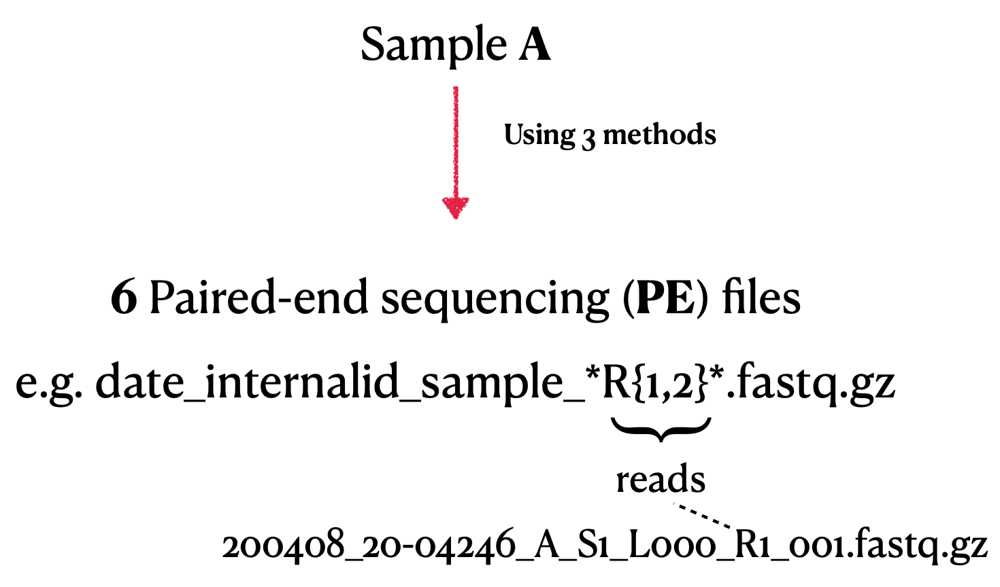

## Overview
This repository provides a complete pipeline for assembling and analyzing the genome of SARS-CoV-2 using Illumina paired-end sequencing data. It includes steps for quality control, mapping, variant calling, primer clipping, consensus sequence generation, lineage annotation, and phylogenetic analysis.

### Key Features
- Automated environment setup using `mamba` and `conda`
- Comprehensive quality control with `fastqc` and `fastp`
- Mapping and visualization using `minimap2`, `samtools`, and `IGV`
- Primer sequence clipping for clean alignments
- Variant calling with `freebayes` and VCF filtering with `vcfR`
- Consensus sequence generation and lineage assignment with `pangolin`
- Phylogenetic analysis and multiple sequence alignment with `mafft` and `iqtree`
- Clear documentation and modular structure

## System Requirements
- **Operating System**: Linux (tested on Fedora 38)
- **Processor**: Intel i5 or equivalent, with multithreading support
- **Memory**: Minimum 8 GB
- **Software**: Anaconda/Miniconda, mamba, R, and the listed bioinformatics tools

## Dependencies
The pipeline requires the following tools, managed via `mamba`:
- QC: `fastqc`, `fastp`, `multiqc`
- Mapping: `minimap2`, `samtools`, `bamclipper`
- Variant Calling: `freebayes`, `vcftools`, `bcftools`
- Sequence Analysis: `vcfR`, `mafft`, `iqtree`, `pangolin`
- Visualization: `gnuplot`, `IGV`, `jalview`

## Installation
1. Clone the repository:
   ```bash
   git clone https://github.com/<username>/sars2-genome-assembly.git
   cd sars2-genome-assembly
   ```
2. Install `mamba` and create the environment:
   ```bash
   wget "https://github.com/conda-forge/miniforge/releases/latest/download/Mambaforge-Linux-x86_64.sh"
   bash Mambaforge-Linux-x86_64.sh
   conda update -y conda
   mamba env create -p ./envs/projectSARS --file environment.yaml
   mamba activate ./envs/projectSARS
   ```

## Pipeline Workflow
1. **Environment Setup**: Install dependencies and configure the environment.
2. **Data Preparation**: Download input datasets and reference genomes.
3. **Quality Control**: Evaluate and preprocess raw sequencing reads.
4. **Mapping**: Align reads to the reference genome.
5. **Primer Clipping**: Remove primer sequences from alignments.
6. **Variant Calling**: Identify variants in the genome.
7. **Filtering & Masking**: Use an R script for QC and filtering of VCF files.
8. **Consensus Generation**: Generate consensus sequences from filtered variants.
9. **Lineage Annotation**: Assign SARS-CoV-2 lineages using `pangolin`.
10. **Phylogenetic Analysis**: Perform multiple sequence alignment and build phylogenetic trees.

## Input Data
- Illumina paired-end sequencing data
- SARS-CoV-2 reference genome (NCBI accession: NC_045512.2)

## Output
- Quality control reports (`.html`, `.json`)
- Aligned sequences in BAM and VCF formats
- Consensus sequences in FASTA format
- Lineage annotations
- Phylogenetic trees and visualizations

## Usage
1. Edit the `config.sh` file to specify input data paths and parameters.
2. Run the pipeline:
   ```bash
   bash scripts/run_pipeline.sh
   ```
3. View results in the `results/` directory.

## References
This pipeline builds on the work of numerous bioinformatics tools and methodologies. Key references include:
- Heng Li, Minimap2: pairwise alignment for nucleotide sequences, Bioinformatics, 2018
- Petr Danecek, James K Bonfield, et al., SAMtools and BCFtools, GigaScience, 2021
- Áine O'Toole, Anthony Underwood, et al., Pangolin tool, Virus Evolution, 2021
- Katoh, K., & Standley, D. M., MAFFT multiple sequence alignment software, Molecular Biology and Evolution, 2013

## Acknowledgments
This project was developed as part of the SARS-2 Bioinformatics & Data Science course by the Freie Universität Berlin and the Robert Koch Institute. Special thanks to Max von Kleist and Martin Hölzer for their guidance.

## License
This project is licensed under the MIT License. See the `LICENSE` file for details.

## Contact
For questions or issues, please contact:
- **Abhinav Mishra**
- Email: mishraabhinav36@gmail.com

 

### Data & File description  
 

## References 

1. bamstats.pl script, 2012-2014 Genome Research Ltd (Author: Petr Danecek <pd3@sanger.ac.uk>)
2. Anon, 2020. Anaconda Software Distribution, Anaconda Inc. Available at: https://docs.anaconda.com/.
3. Philip Ewels, Måns Magnusson, Sverker Lundin, Max Käller, MultiQC: summarize analysis results for
multiple tools and samples in a single report, Bioinformatics, Volume 32, Issue 19, October 2016, Pages
3047–3048, https://doi.org/10.1093/bioinformatics/btw354
4. Andrews, S. (2010). FastQC: A Quality Control Tool for High Throughput Sequence Data [Online].
5. Shifu Chen, Yanqing Zhou, Yaru Chen, Jia Gu, fastp: an ultra-fast all-in-one FASTQ preprocessor,
Bioinformatics, Volume 34, Issue 17, September 2018, Pages i884–i890, https://doi.org/10.1093/bioinformatics/bty560
6. Heng Li, Minimap2: pairwise alignment for nucleotide sequences, Bioinformatics, Volume 34,
Issue 18, September 2018, Pages 3094–3100, https://doi.org/10.1093/bioinformatics/bty191
7. Petr Danecek, James K Bonfield, Jennifer Liddle, John Marshall, Valeriu Ohan, Martin O
Pollard, Andrew Whitwham, Thomas Keane, Shane A McCarthy, Robert M Davies, Heng Li,
Twelve years of SAMtools and BCFtools, GigaScience, Volume 10, Issue 2, February 2021,
giab008, https://doi.org/10.1093/gigascience/giab008
8. Robinson, J. T., Thorvaldsdóttir, H., Winckler, W., Guttman, M., Lander, E. S., Getz, G., &
Mesirov, J. P. (2011). Integrative genomics viewer. Nature biotechnology, 29(1), 24–26. https://doi.org/10.1038/nbt.1754
9. O'Toole Á, Hill V, Pybus OG et al. Tracking the international spread of SARS-CoV-2 lineages B.1.1.7 and
B.1.351/501Y-V2 [version 1; peer review: 3 approved]. Wellcome Open Res 2021, 6:121 (https://doi.org/10.12688/wellcomeopenres.16661.1)
10. Áine O’Toole, Emily Scher, Anthony Underwood, Ben Jackson, Verity Hill, John T McCrone, Rachel
Colquhoun, Chris Ruis, Khalil Abu-Dahab, Ben Taylor, Corin Yeats, Louis du Plessis, Daniel Maloney, Nathan
Medd, Stephen W Attwood, David M Aanensen, Edward C Holmes, Oliver G Pybus, Andrew Rambaut,
Assignment of epidemiological lineages in an emerging pandemic using the pangolin tool, Virus Evolution,
Volume 7, Issue 2, December 2021, veab064, https://doi.org/10.1093/ve/veab064
11. Rambaut, A., Holmes, E.C., O’Toole, Á. et al. A dynamic nomenclature proposal for SARS-CoV-2 lineages to
assist genomic epidemiology. Nat Microbiol 5, 1403–1407 (2020). https://doi.org/10.1038/s41564-020-0770-5
12. Tool for QC with consensus sequences https://github.com/rki-mf1/president
13. Au, C., Ho, D., Kwong, A. et al. BAMClipper: removing primers from alignments to
minimize false-negative mutations in amplicon next-generation sequencing. Sci Rep 7, 1567
(2017). https://doi.org/10.1038/s41598-017-01703-6
14. Garrison E, Marth G. Haplotype-based variant detection from short-read sequencing.
arXiv preprint arXiv:1207.3907 [q-bio.GN] 2012
15. Vcflib and tools for processing the VCF variant call format. Erik Garrison, Zev N.
Kronenberg, Eric T. Dawson, Brent S. Pedersen, Pjotr Prins. bioRxiv 2021.05.21.445151; doi:
https://doi.org/10.1101/2021.05.21.445151
16. Petr Danecek, Adam Auton, Goncalo Abecasis, Cornelis A. Albers, Eric Banks, Mark A. DePristo, Robert E. Handsaker,
Gerton Lunter, Gabor T. Marth, Stephen T. Sherry, Gilean McVean, Richard Durbin, 1000 Genomes Project Analysis
Group, The variant call format and VCFtools, Bioinformatics, Volume 27, Issue 15, August 2011, Pages 2156–2158, https://doi.org/10.1093/bioinformatics/btr330
17. Waterhouse, A.M., Procter, J.B., Martin, D.M.A, Clamp, M., Barton, G.J (2009), "Jalview version 2: A Multiple Sequence
Alignment and Analysis Workbench,” Bioinformatics 25 (9) 1189-1191 doi: 10.1093/bioinformatics/btp033
18. Nguyen, L. T., Schmidt, H. A., von Haeseler, A., & Minh, B. Q. (2015). IQ-TREE: a fast and effective stochastic algorithm
for estimating maximum-likelihood phylogenies. Molecular biology and evolution, 32(1), 268–274. https://doi.org/10.1093/molbev/msu300
19. Bui Quang Minh, Heiko A Schmidt, Olga Chernomor, Dominik Schrempf, Michael D Woodhams, Arndt von Haeseler,
Robert Lanfear, IQ-TREE 2: New Models and Efficient Methods for Phylogenetic Inference in the Genomic Era, Molecular
Biology and Evolution, Volume 37, Issue 5, May 2020, Pages 1530–1534, https://doi.org/10.1093/molbev/msaa015
20. Aaron R. Quinlan, Ira M. Hall, BEDTools: a flexible suite of utilities for comparing genomic features,
Bioinformatics, Volume 26, Issue 6, March 2010, Pages 841–842, https://doi.org/10.1093/bioinformatics/btq033
21. Katoh, K., & Standley, D. M. (2013). MAFFT multiple sequence alignment software version 7: improvements in
performance and usability. Molecular biology and evolution, 30(4), 772–780. https://doi.org/10.1093/molbev/mst010
22. R Core Team (2022). R: A language and environment for statistical computing. R Foundation for Statistical
Computing, Vienna, Austria. URL https://www.R-project.org/.
23. Knaus, B.J. and Grünwald, N.J. (2017), vcfr: a package to manipulate and visualize variant call format data in R.
Mol Ecol Resour, 17: 44-53. https://doi.org/10.1111/1755-0998.12549
24. National Center for Biotechnology Information (NCBI)[Internet]. Bethesda (MD): National Library of
Medicine (US), National Center for Biotechnology Information; [1988] – [cited 2023 Sep 29]. Available from:
https://www.ncbi.nlm.nih.gov/

### Device Info 

The analysis and results was done and generated on 

**OS**          Fedora Linux 38 <br>
**Kernel**      Linux 6.4.15-200.fc38.x86_64 <br>
**Processor**   Intel i5-8250U (8 slots), with CUDA support <br>
**Graphics**    UHD 620 (KBL GT2) <br>
**Memory**      8 GB 

# SARS-CoV-2 genome assembly from Illumina reads 
Course: [SARS-2 Bioinformatics & Data Science](https://github.com/rki-mf1/2023-SC2-Data-Science) <br>
Intructors: Max von Kleist, Martin Hölzer <br>
Institution: Freie Universität Berlin, Robert-Koch Institute <br> 
