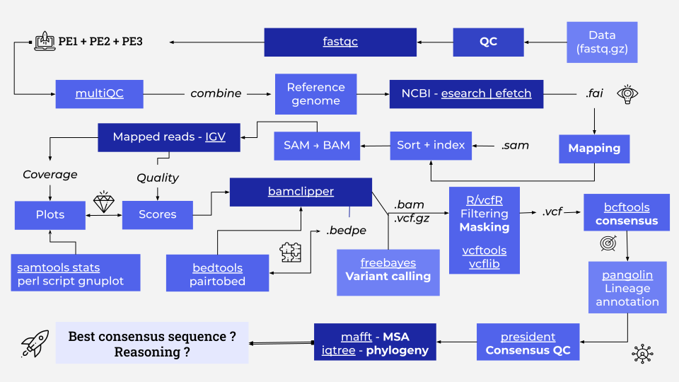
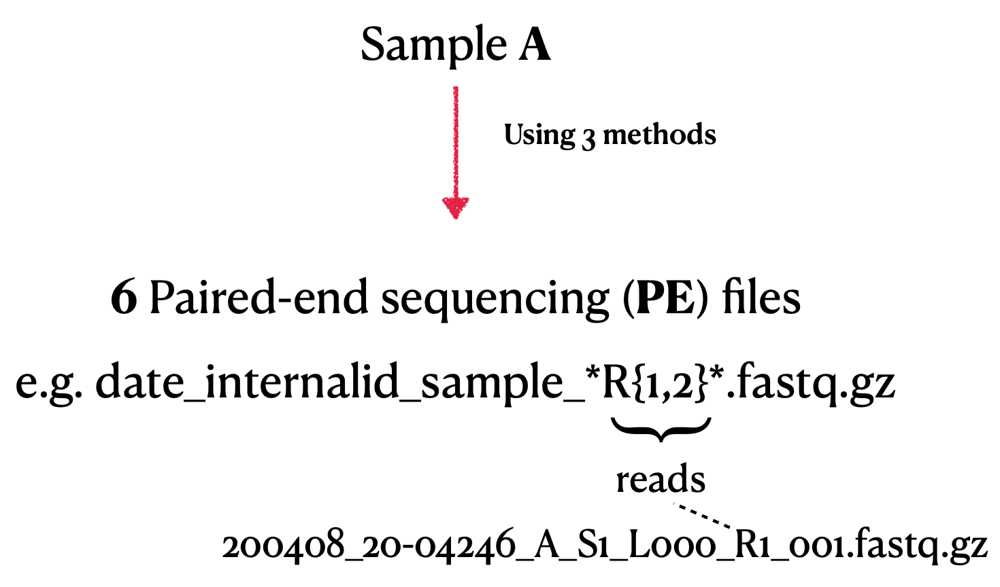

# SARS-CoV-2 Genome Assembly from Illumina Reads

Welcome to the documentation for the `nf-illumina2lineage` pipeline.

## Overview
This repository provides a complete pipeline for assembling and analyzing the genome of SARS-CoV-2 using Illumina paired-end sequencing data. It includes steps for quality control, mapping, variant calling, primer clipping, consensus sequence generation, lineage annotation, and phylogenetic analysis.

### Key Features
- Automated environment setup using `mamba` and `conda`
- Comprehensive quality control with `fastqc` and `fastp`
- Mapping and visualization using `minimap2`, `samtools`, and `IGV`
- Primer sequence clipping for clean alignments
- Variant calling with `freebayes` and VCF filtering with `vcfR`
- Consensus sequence generation and lineage assignment with `pangolin`
- Phylogenetic analysis and multiple sequence alignment with `mafft` and `iqtree`
- Clear documentation and modular structure

## System Requirements
- **Operating System**: Linux (tested on Fedora 38)
- **Processor**: Intel i5 or equivalent, with multithreading support
- **Memory**: Minimum 8 GB
- **Software**: Anaconda/Miniconda, mamba, R, and the listed bioinformatics tools

## Dependencies
The pipeline requires the following tools, managed via `mamba`:
- QC: `fastqc`, `fastp`, `multiqc`
- Mapping: `minimap2`, `samtools`, `bamclipper`
- Variant Calling: `freebayes`, `vcftools`, `bcftools`
- Sequence Analysis: `vcfR`, `mafft`, `iqtree`, `pangolin`
- Visualization: `gnuplot`, `IGV`, `jalview`

## Installation
1. Clone the repository:
   ```bash
   git clone https://github.com/bibymaths/nf-illumina2lineage.git
   cd nf-illumina2lineage
   ```
2. Install `mamba` and create the environment:
   ```bash
   wget "https://github.com/conda-forge/miniforge/releases/latest/download/Mambaforge-Linux-x86_64.sh"
   bash Mambaforge-Linux-x86_64.sh
   conda update -y conda
   mamba env create -p ./envs/projectSARS --file environment.yaml
   mamba activate ./envs/projectSARS
   ```

## Pipeline Workflow
1. **Environment Setup**: Install dependencies and configure the environment.
2. **Data Preparation**: Download input datasets and reference genomes.
3. **Quality Control**: Evaluate and preprocess raw sequencing reads.
4. **Mapping**: Align reads to the reference genome.
5. **Primer Clipping**: Remove primer sequences from alignments.
6. **Variant Calling**: Identify variants in the genome.
7. **Filtering & Masking**: Use an R script for QC and filtering of VCF files.
8. **Consensus Generation**: Generate consensus sequences from filtered variants.
9. **Lineage Annotation**: Assign SARS-CoV-2 lineages using `pangolin`.
10. **Phylogenetic Analysis**: Perform multiple sequence alignment and build phylogenetic trees.

## Input Data
- Illumina paired-end sequencing data
- SARS-CoV-2 reference genome (NCBI accession: NC_045512.2)

## Output
- Quality control reports (`.html`, `.json`)
- Aligned sequences in BAM and VCF formats
- Consensus sequences in FASTA format
- Lineage annotations
- Phylogenetic trees and visualizations

## Usage
1. Edit the `config.sh` file to specify input data paths and parameters.
2. Run the pipeline:
   ```bash
   bash scripts/run_pipeline.sh
   ```
3. View results in the `results/` directory.





## License
This project is licensed under the MIT License. See the `LICENSE` file for details.

## Contact
For questions or issues, please contact:
- **Abhinav Mishra**
- Email: mishraabhinav36@gmail.com
