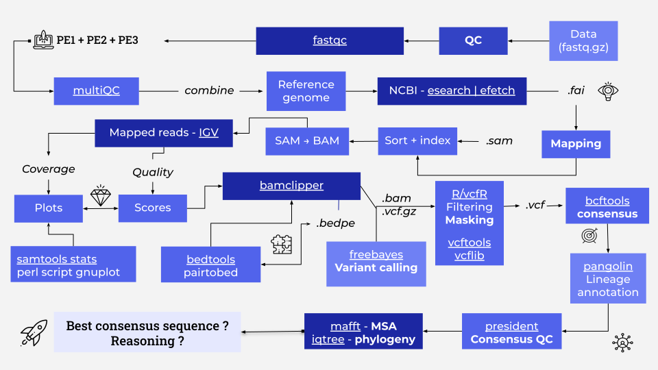
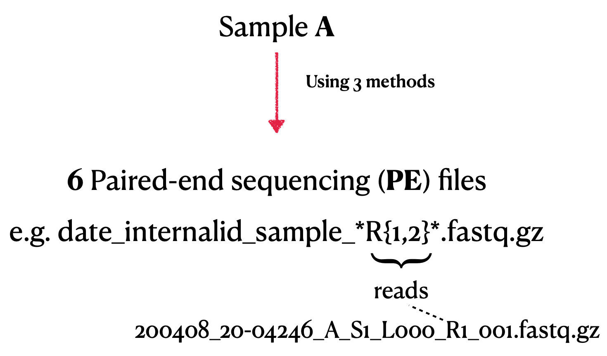

Welcome to the documentation for the `nf-illumina2lineage` pipeline.

## Overview

This repository provides a complete pipeline for assembling and analyzing the genome of SARS-CoV-2 using Illumina
paired-end sequencing data. It includes steps for quality control, mapping, variant calling, primer clipping, consensus
sequence generation, lineage annotation, and phylogenetic analysis.

### Key Features

- Automated environment setup using `pixi`
- Comprehensive quality control with `fastqc` and `fastp`
- Mapping and visualization using `minimap2`, `samtools`, and `IGV`
- Primer sequence clipping for clean alignments
- Variant calling with `freebayes`
- Consensus sequence generation and lineage assignment with `pangolin`
- Phylogenetic analysis and multiple sequence alignment with `mafft` and `iqtree`
- Clear documentation and modular structure

## System Requirements

- **Operating System**: Linux (tested on Fedora 38)
- **Processor**: Intel i5 or higher, with multithreading support
- **Memory**: Minimum 8 GB

## Dependencies

The pipeline requires the following tools, managed via `mamba`:

- QC: `fastqc`, `fastp`, `multiqc`
- Mapping: `minimap2`, `samtools`, `bamclipper`
- Variant Calling: `freebayes`, `vcftools`, `bcftools`
- Sequence Analysis: `mafft`, `iqtree`, `pangolin`
- Visualization: `IGV`

## Input Data

- Illumina paired-end sequencing data
- SARS-CoV-2 reference genome (NCBI accession: NC_045512.2)

## Output

- Quality control reports (`.html`, `.json`)
- Aligned sequences in BAM and VCF formats
- Consensus sequences in FASTA format
- Lineage annotations
- Phylogenetic trees and visualizations

