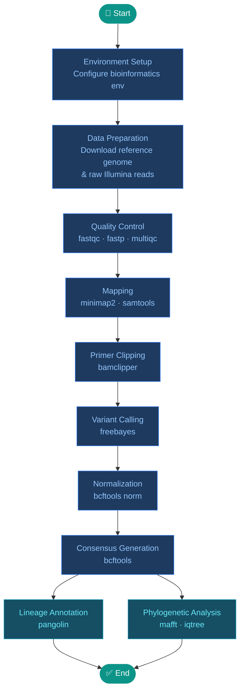

```mermaid
flowchart TD
    A([🧬 Start]) --> B[Environment Setup\nConfigure bioinformatics env]
    B --> C[Data Preparation\nDownload reference genome\n& raw Illumina reads]
    C --> D[Quality Control\nfastqc · fastp · multiqc]
    D --> E[Mapping\nminimap2 · samtools]
    E --> F[Primer Clipping\nbamclipper]
    F --> G[Variant Calling\nfreebayes]
    G --> H[Normalization\nbcftools norm]
    H --> I[Consensus Generation\nbcftools]
    I --> J[Lineage Annotation\npangolin]
    I --> K[Phylogenetic Analysis\nmafft · iqtree]
    J --> L([✅ End])
    K --> L

    style A fill:#0D9488,color:#fff,stroke:none
    style L fill:#0D9488,color:#fff,stroke:none
    style B fill:#1E3A5F,color:#93C5FD,stroke:#3B82F6
    style C fill:#1E3A5F,color:#93C5FD,stroke:#3B82F6
    style D fill:#1E3A5F,color:#93C5FD,stroke:#3B82F6
    style E fill:#1E3A5F,color:#93C5FD,stroke:#3B82F6
    style F fill:#1E3A5F,color:#93C5FD,stroke:#3B82F6
    style G fill:#1E3A5F,color:#93C5FD,stroke:#3B82F6
    style H fill:#1E3A5F,color:#93C5FD,stroke:#3B82F6
    style I fill:#1E3A5F,color:#93C5FD,stroke:#3B82F6
    style J fill:#164E63,color:#67E8F9,stroke:#0891B2
    style K fill:#164E63,color:#67E8F9,stroke:#0891B2
```